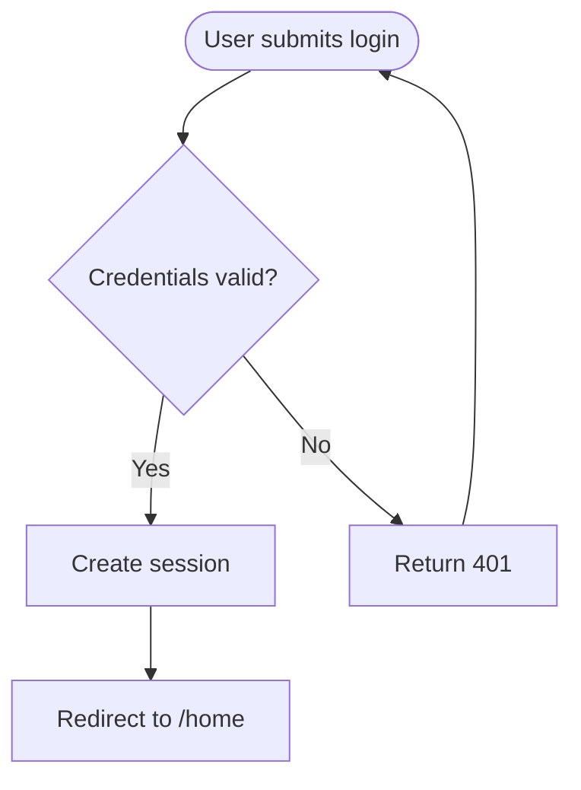

# Mermaid Diagram Generator

> Adapted from [WH-2099/mermaid-skill](https://github.com/WH-2099/mermaid-skill) on 2026-05-15. Reference syntax docs are bundled under `references/` and originate from the upstream Mermaid project. The `## Verification` section incorporates the render-check recipe and parse-pitfalls table from [WH-2099/mermaid-skill#5](https://github.com/WH-2099/mermaid-skill/pull/5) by @rajatarya.

Generate Mermaid diagram source that renders directly in GitHub, VS Code, Notion, and other Mermaid-aware viewers.

## Invocation Position

Side-route utility. Mermaid is most useful **inside other pipeline artifacts** — a sequence diagram inside a PRD, a flowchart inside a research note, an ER diagram inside an issue body, a C4 diagram inside an architecture proposal. Invoke it directly when:

- The user explicitly asks for a Mermaid diagram, flowchart, sequence diagram, ER diagram, state machine, Gantt chart, etc.
- A pipeline skill (`/shape`, `/research`, `/write-a-prd`, `/prd-to-issues`, `/improve-codebase-architecture`, `/request-refactor-plan`) would benefit from an embedded diagram and the user wants one.

Do not invoke when:
- The user wants a rough whiteboard sketch — use `/excalidraw-diagram` instead.
- The user wants a rendered image file — Mermaid here produces source code, not PNGs.
- The diagram type is unsupported by Mermaid (e.g. arbitrary 2D illustrations).

This skill does not produce a GitHub artifact on its own and does not advance the pipeline. After producing the diagram, control returns to whichever skill or conversation invoked it.

## Workflow

1. **Identify the diagram type.** Map the user's description to one of the 23 supported types (see the table below). If the description is ambiguous (e.g. "show the flow"), ask one clarifying question — flow of *what*, between *whom*? Do not guess between flowchart vs. sequence vs. state diagram when the choice changes the diagram meaningfully.
2. **Read the matching reference file.** Each diagram type has a syntax reference under `references/`. Read it before generating code — Mermaid syntax is strict and version-sensitive, and the references are the source of truth.
3. **Generate the code.** Wrap output in a fenced ```mermaid block. Use semantic node IDs (`UserLogin`, not `A`), readable labels, and direction/layout hints that match the diagram's purpose (`flowchart TD` for top-down decision trees, `flowchart LR` for pipelines, etc.).
4. **Apply theming or directives only when they add clarity.** See `references/config-theming.md` and `references/config-directives.md`. Defaults are usually fine; skip styling unless the user asked for it or the diagram is unreadable without it.
5. **Verify rendering.** Render every diagram with `mmdc` before declaring the work complete — see [Verification](#verification) below. Mermaid syntax errors are silent in markdown viewers, so eyeballing is not enough.

## Diagram Type Reference

| Type | Reference | Typical use |
|------|-----------|-------------|
| Flowchart | [flowchart.md](references/flowchart.md) | Processes, decisions, pipelines |
| Sequence Diagram | [sequenceDiagram.md](references/sequenceDiagram.md) | API calls, message flows, interactions |
| Class Diagram | [classDiagram.md](references/classDiagram.md) | Class structure, inheritance, associations |
| State Diagram | [stateDiagram.md](references/stateDiagram.md) | State machines, transitions |
| ER Diagram | [entityRelationshipDiagram.md](references/entityRelationshipDiagram.md) | Database schema, entity relationships |
| Gantt Chart | [gantt.md](references/gantt.md) | Project timelines, scheduling |
| Pie Chart | [pie.md](references/pie.md) | Proportions, distributions |
| Mindmap | [mindmap.md](references/mindmap.md) | Hierarchical brainstorming |
| Timeline | [timeline.md](references/timeline.md) | Historical events, milestones |
| Git Graph | [gitgraph.md](references/gitgraph.md) | Branching, merges |
| Quadrant Chart | [quadrantChart.md](references/quadrantChart.md) | 2×2 trade-off analysis |
| Requirement Diagram | [requirementDiagram.md](references/requirementDiagram.md) | Requirements traceability |
| C4 Diagram | [c4.md](references/c4.md) | System architecture (C4 model) |
| Sankey Diagram | [sankey.md](references/sankey.md) | Flow volumes, conversions |
| XY Chart | [xyChart.md](references/xyChart.md) | Line and bar charts |
| Block Diagram | [block.md](references/block.md) | System components, modules |
| Packet Diagram | [packet.md](references/packet.md) | Network protocols, byte layouts |
| Kanban | [kanban.md](references/kanban.md) | Task boards |
| Architecture Diagram | [architecture.md](references/architecture.md) | Cloud / service architecture |
| Radar Chart | [radar.md](references/radar.md) | Multi-dimensional comparison |
| Treemap | [treemap.md](references/treemap.md) | Hierarchical proportions |
| User Journey | [userJourney.md](references/userJourney.md) | UX flows with sentiment |
| ZenUML | [zenuml.md](references/zenuml.md) | Code-style sequence diagrams |

## Configuration & Theming

- [Theming](references/config-theming.md) — colors, fonts, custom themes
- [Directives](references/config-directives.md) — per-diagram configuration
- [Layouts](references/config-layouts.md) — direction and spacing
- [Configuration](references/config-configuration.md) — global settings
- [Math](references/config-math.md) — LaTeX math support
- [Tidy Tree](references/config-tidy-tree.md) — tidy-tree layout tuning
- [Examples](references/examples.md) — curated examples across types

## Output Specification

Generated Mermaid code must:

1. Be wrapped in a ```mermaid fenced block.
2. Use syntax that renders without modification in standard Mermaid viewers (confirmed via [Verification](#verification)).
3. Use semantic, human-readable node IDs and labels.
4. Be indented and line-broken for readability.
5. Use styling only when it materially improves clarity.
6. For sequence, state, and entity-relationship diagrams destined for a theme-aware viewer (GitHub, Notion, etc.), prepend the contrast-safe `%%{init: ...}%%` directive from [`references/contrast-for-github.md`](references/contrast-for-github.md). Flowcharts and other diagram types do not need this — their default rendering reads correctly in both light and dark mode.

## Example



## Verification

**Always render every diagram before declaring the work done.** Mermaid produces syntax errors that markdown viewers swallow silently — verification is the only way to catch them.

### Recipe

Run from any shell. No install needed; `npx` fetches `mmdc` (mermaid-cli) on first use.

```bash
# 1. Extract every ```mermaid fenced block from the target file into its own .mmd
awk '/^```mermaid$/{flag=1; n++; outfile=sprintf("/tmp/mmd-check-%d.mmd",n); next}
     /^```$/ && flag{flag=0; next}
     flag{print > outfile}' <PATH_TO_MARKDOWN_FILE>

# 2. Render each. Any parse error in the output means the diagram won't render.
for f in /tmp/mmd-check-*.mmd; do
  echo "=== $f ==="
  npx --yes -p @mermaid-js/mermaid-cli mmdc -i "$f" -o "${f%.mmd}.svg" 2>&1 \
    | grep -E "Generating|Error|expecting|got " | head -5
done
```

A clean run prints `Generating single mermaid chart` for each block and writes an SVG. A broken block prints `Error: Parse error on line N: Expecting ..., got ...` — fix that block and re-run before moving on.

If you generated a single diagram inline (no file yet), pipe it directly:

```bash
echo 'graph TD
    A --> B' | npx --yes -p @mermaid-js/mermaid-cli mmdc -i /dev/stdin -o /tmp/check.svg
```

### Common parse pitfalls

| Symptom | Cause | Fix |
|---|---|---|
| Parse error in `participant X as ...` alias | A `+` or `-` in the display name is parsed as activation/deactivation syntax | Spell out: replace `+` with `and`, drop `-` |
| Diamond/decision node won't render | Unquoted `<=` / `>=` / `<` / `>` in `{...}` — parser sees an HTML tag | Quote (`{"end &le; size"}`) or use HTML entities |
| Flowchart node label with `(...)` cuts off | Unquoted `()` inside `[label]` — parser ambiguity | Always quote: `["foo (bar)"]` |
| `&&` or stray `&` mangles the diagram | `&` is the HTML-entity start character | Use `and`, or escape as `&amp;&amp;` |
| Sequence-diagram message starting with `{` | Curly braces near `:` look like control structures | Replace with `[...]` or rewrite the message |
| Nested unbalanced brackets in an arrow message (e.g. `[a=[b]]`) | Parser bails on the inner `[` | Flatten to comma-separated text |
| Markdown links / wikilinks inside a node label | Not interpreted; renders as raw `[[...]]` | Move the link out of the diagram, or use plain text |

**Quoting rule of thumb:** if a node label contains *any* of `()`, `[]`, `<`, `>`, `:`, `=`, `,`, `;`, `&`, or unbalanced quotes, wrap the whole label in double quotes (`["..."]` for rectangles, `{"..."}` for diamonds).

### Contrast fast-check (theme-aware viewers only)

If the diagram type is **sequence**, **state**, or **entity-relationship** and the destination is a theme-aware viewer (GitHub, Notion, etc.), scan the fenced block for the contrast-safe `%%{init: ...}%%` directive described in [`references/contrast-for-github.md`](references/contrast-for-github.md). 5-second visual check — no re-render required. `mmdc`'s default theme matches the agent's local environment, not the reader's, so a clean parse does not imply readable text on a dark-mode page. See the reference for the per-diagram templates and an optional dark-render SVG inspection if you want belt-and-braces.

## Handoff

- **Expected input:** A description of what the user wants to visualize, or an invoking skill that needs an embedded diagram.
- **Produces:** Mermaid source code in a fenced block, optionally followed by a one-line explanation of what the diagram shows.
- **Comes next by default:** Control returns to the invoking skill or conversation. If invoked standalone, the diagram is the final output unless the user asks for revisions.
- **May redirect:** Suggest `/excalidraw-diagram` if the user really wants a free-form sketch rather than a structured Mermaid diagram.
