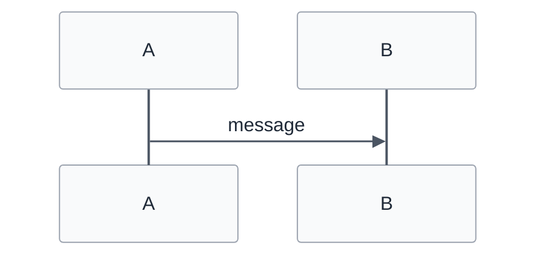
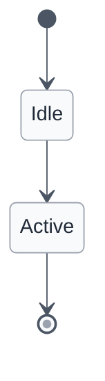
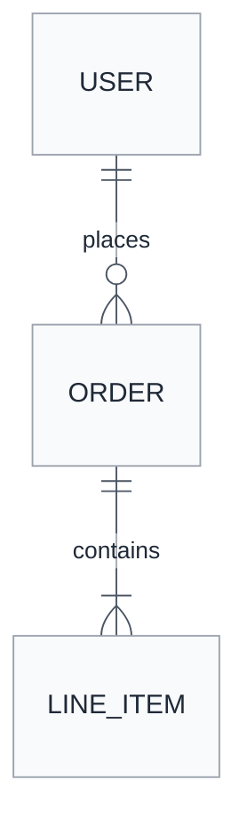

# Contrast safety for GitHub-bound diagrams

GitHub renders Mermaid natively and picks the theme (light or dark) from the reader's color scheme. A diagram authored without explicit theme variables uses Mermaid's defaults, which paint sequence-message text, state labels, and ER entity rows in pale colors when the dark theme is active. Layered on light pastel `rect rgb(...)` phase bands or default light fills, the resulting text-on-fill contrast is effectively zero. Parse-only verification with `mmdc` does not surface this — `mmdc`'s default theme matches the agent's local environment, not the reader's.

Three diagram types are affected: **sequence**, **state**, and **entity-relationship**. Flowcharts are not affected — their per-node `classDef` rules pin `color:` per node and override the theme. Other types (gantt, pie, mindmap, etc.) have not exhibited this failure mode.

## When to apply

Apply the init directive when **all** of the following are true:

- The diagram type is sequence, state, or ER.
- The destination is a theme-aware viewer (GitHub, Notion, anything that switches theme based on the reader's color scheme).
- You are not deliberately producing a dark-only or light-only artifact.

If the diagram only ever appears in a light-mode-only context (a screenshot, a printed PDF, a fixed-theme docs site), the directive is optional.

## Templates

Each template uses Mermaid's `base` theme — the only theme that accepts custom `themeVariables` (see [config-theming.md](config-theming.md)) — and pins text to `#1f2937` (slate-800) on `#f9fafb` (slate-50) backgrounds. These values read cleanly in both GitHub light and GitHub dark.

### Sequence diagram



The variables that close the dark-mode gap are `signalTextColor` (arrow message labels), `noteTextColor` (Note over … blocks), `labelTextColor` (rect / loop / alt labels), and `actorTextColor` (participant headers). The rest are included so phase-band `rect rgb(...)` overlays still read cleanly.

### State diagram



`primaryTextColor` covers state names; `labelTextColor` covers transition labels.

### Entity-relationship diagram



`primaryTextColor` covers entity titles and attribute rows. The two attribute-row background colors are pinned so zebra-striping stays readable when GitHub's dark theme would otherwise tint them.

## Verification (belt-and-braces)

The Verification section of [SKILL.md](../SKILL.md#verification) recommends a 5-second visual scan to confirm the init directive is present on sequence/state/ER blocks destined for theme-aware viewers. For higher-stakes diagrams (a PRD that will be reviewed widely, an issue that will be cited downstream), you can render under the dark theme and grep the SVG for the pinned text color:

```bash
# Render with the dark theme to surface what a dark-mode GitHub reader sees.
npx --yes -p @mermaid-js/mermaid-cli mmdc \
  -i diagram.mmd -o /tmp/dark.svg -t dark -b transparent

# Confirm message / note / state labels use the pinned text color, not a pale default.
grep -oE '(messageText|noteText|stateLabel|label)[^}]*fill:[^;"]+' /tmp/dark.svg
```

The `fill:` for each matching class should be `#1f2937` (or whatever pinned color you chose). A pale `#fff` / `#e3e3e3` / pinkish lavender means the init directive did not stick — usually a typo in a variable name or the directive landed below the diagram type declaration (the `%%{init}%%` block must be the first line of the fenced block).

## Version-drift note

The themeVariables surface is real but has shifted between Mermaid majors. The list of variables and their effects is documented in [config-theming.md](config-theming.md), which is auto-generated from the upstream Mermaid project — re-read it on major Mermaid version bumps. If a pinned variable is renamed or removed upstream, the diagram silently degrades to the new default, which may or may not preserve contrast. The verification grep above is the cheapest detection: if it stops finding the pinned `fill:`, the template needs a refresh.

The `base` theme remains the only customizable theme as of this writing. If that changes, prefer the explicitly customizable theme over chasing variable renames.
